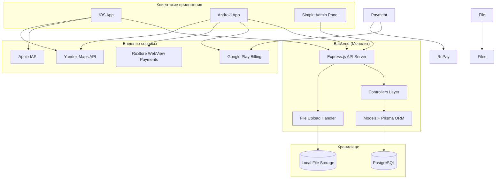

# Документ дизайна MVP - Аудиогид по Дагестану

## Обзор

MVP системы "Аудиогид по Дагестану" представляет собой упрощенное решение, состоящее из мобильного приложения для iOS/Android и минимальной веб-панели администратора. Архитектура построена на принципах простоты и быстрого запуска с монолитным backend API.

## Архитектура

### MVP Архитектура (Упрощенная)



### Технологический стек

**Backend:**
- Node.js с Express.js или Python с FastAPI
- PostgreSQL для основных данных
- Redis для кэширования и сессий
- AWS S3 или аналог для хранения файлов

**Mobile:**
- React Native или Flutter для кроссплатформенной разработки
- Альтернативно: нативная разработка (Swift/Kotlin)

**Web Admin Panel:**
- React.js с TypeScript
- Material-UI или Ant Design для компонентов

## Компоненты и интерфейсы

### 1. Мобильное приложение

#### 1.1 Главный экран (HomeScreen)
```typescript
interface Tour {
  id: string;
  title: string;
  description: string;
  banner: string;
  attributes: ('new' | 'popular')[];
  duration: number; // в минутах
  distance: number; // в метрах
  price: number;
  isPurchased: boolean;
}

interface HomeScreenProps {
  tours: Tour[];
  onTourSelect: (tourId: string) => void;
}
```

#### 1.2 Экран деталей тура (TourDetailScreen)
```typescript
interface TourDetail extends Tour {
  fullDescription: string;
  audioDescription: string; // URL аудиофайла
  previewPOIs: POI[]; // первые несколько бесплатных точек
  route: RouteData;
}

interface POI {
  id: string;
  title: string;
  description: string;
  audioUrl: string;
  coordinates: [number, number]; // [lat, lng]
  isFree: boolean;
}
```

#### 1.3 Компонент карты (MapComponent)
```typescript
interface MapComponentProps {
  route: RouteData;
  pois: POI[];
  onPOITap: (poi: POI) => void;
  userLocation?: [number, number];
}

interface RouteData {
  coordinates: [number, number][];
  bounds: {
    northeast: [number, number];
    southwest: [number, number];
  };
}
```

#### 1.4 Система платежей (PaymentService)
```typescript
interface PaymentService {
  initializePlatformPayments(): Promise<void>;
  purchaseTour(tourId: string): Promise<PurchaseResult>;
  restorePurchases(): Promise<string[]>;
}

interface PurchaseResult {
  success: boolean;
  transactionId?: string;
  error?: string;
}
```

### 2. Веб-панель администратора

#### 2.1 Управление турами (TourManagement)
```typescript
interface AdminTour {
  id?: string;
  title: string;
  description: string;
  fullDescription: string;
  banner: File | string;
  audioDescription: File | string;
  attributes: string[];
  price: number;
  routeFile?: File; // KML/GPX файл
  pois: AdminPOI[];
}

interface AdminPOI {
  id?: string;
  title: string;
  description: string;
  audioFile: File | string;
  coordinates: [number, number];
  isFree: boolean;
  order: number;
}
```

#### 2.2 Обработка файлов маршрутов (RouteProcessor)
```typescript
interface RouteProcessor {
  parseKMLFile(file: File): Promise<ParsedRoute>;
  parseGPXFile(file: File): Promise<ParsedRoute>;
  validateRoute(route: ParsedRoute): ValidationResult;
}

interface ParsedRoute {
  coordinates: [number, number][];
  waypoints: Waypoint[];
  metadata: RouteMetadata;
}

interface Waypoint {
  name: string;
  description?: string;
  coordinates: [number, number];
}
```

### 3. Backend API

#### 3.1 Tours API
```typescript
// GET /api/tours
interface ToursResponse {
  tours: Tour[];
  total: number;
  page: number;
}

// GET /api/tours/:id
interface TourDetailResponse {
  tour: TourDetail;
  userAccess: {
    hasPurchased: boolean;
    freeAccessCount: number;
  };
}

// POST /api/tours (Admin only)
interface CreateTourRequest {
  tourData: AdminTour;
  routeFile?: File;
}
```

#### 3.2 Payment API
```typescript
// POST /api/payments/purchase
interface PurchaseRequest {
  tourId: string;
  platform: 'ios' | 'android_gplay' | 'android_rustore';
  receipt: string; // платформо-специфичный receipt
}

interface PurchaseResponse {
  success: boolean;
  purchaseId: string;
  expiresAt?: Date;
}
```

## Модели данных

### База данных PostgreSQL

```sql
-- Таблица туров
CREATE TABLE tours (
    id UUID PRIMARY KEY DEFAULT gen_random_uuid(),
    title VARCHAR(255) NOT NULL,
    description TEXT,
    full_description TEXT,
    banner_url VARCHAR(500),
    audio_description_url VARCHAR(500),
    duration_minutes INTEGER,
    distance_meters INTEGER,
    price_cents INTEGER,
    attributes JSONB DEFAULT '[]',
    route_data JSONB,
    created_at TIMESTAMP DEFAULT NOW(),
    updated_at TIMESTAMP DEFAULT NOW()
);

-- Таблица точек интереса
CREATE TABLE pois (
    id UUID PRIMARY KEY DEFAULT gen_random_uuid(),
    tour_id UUID REFERENCES tours(id) ON DELETE CASCADE,
    title VARCHAR(255) NOT NULL,
    description TEXT,
    audio_url VARCHAR(500),
    latitude DECIMAL(10, 8) NOT NULL,
    longitude DECIMAL(11, 8) NOT NULL,
    is_free BOOLEAN DEFAULT false,
    order_index INTEGER,
    created_at TIMESTAMP DEFAULT NOW()
);

-- Таблица пользователей
CREATE TABLE users (
    id UUID PRIMARY KEY DEFAULT gen_random_uuid(),
    device_id VARCHAR(255) UNIQUE,
    platform VARCHAR(50),
    created_at TIMESTAMP DEFAULT NOW()
);

-- Таблица покупок
CREATE TABLE purchases (
    id UUID PRIMARY KEY DEFAULT gen_random_uuid(),
    user_id UUID REFERENCES users(id),
    tour_id UUID REFERENCES tours(id),
    platform VARCHAR(50),
    transaction_id VARCHAR(255),
    receipt_data TEXT,
    purchased_at TIMESTAMP DEFAULT NOW(),
    expires_at TIMESTAMP
);
```

## Обработка ошибок

### 1. Клиентские ошибки
```typescript
enum ErrorType {
  NETWORK_ERROR = 'NETWORK_ERROR',
  PAYMENT_FAILED = 'PAYMENT_FAILED',
  INVALID_RECEIPT = 'INVALID_RECEIPT',
  TOUR_NOT_FOUND = 'TOUR_NOT_FOUND',
  UNAUTHORIZED = 'UNAUTHORIZED'
}

interface AppError {
  type: ErrorType;
  message: string;
  details?: any;
}
```

### 2. Обработка ошибок платежей
- Retry логика для временных сбоев
- Валидация receipts на backend
- Graceful fallback при недоступности платежных систем
- Логирование всех транзакций для аудита

### 3. Обработка ошибок карт
- Fallback на базовую карту при недоступности кастомных стилей
- Кэширование тайлов карт для офлайн режима (будущая функция)
- Обработка ошибок геолокации

## Стратегия тестирования

### 1. Unit тесты
- Тестирование бизнес-логики компонентов
- Тестирование парсеров KML/GPX файлов
- Тестирование платежных сервисов (с моками)

### 2. Integration тесты
- Тестирование API endpoints
- Тестирование интеграции с внешними сервисами
- Тестирование процесса покупки end-to-end

### 3. E2E тесты
- Тестирование пользовательских сценариев
- Тестирование на реальных устройствах
- Тестирование процесса публикации в сторы

### 4. Тестирование производительности
- Нагрузочное тестирование API
- Тестирование времени загрузки карт
- Тестирование воспроизведения аудио

## Безопасность

### 1. Аутентификация и авторизация
- JWT токены для API аутентификации
- Роли пользователей (admin, user)
- Rate limiting для API endpoints

### 2. Валидация данных
- Валидация всех входящих данных на backend
- Санитизация пользовательского контента
- Валидация географических координат

### 3. Защита платежей
- Валидация receipts на стороне сервера
- Шифрование чувствительных данных
- Аудит всех финансовых операций

## Развертывание и масштабирование

### 1. Инфраструктура
- Контейнеризация с Docker
- Оркестрация с Kubernetes или Docker Compose
- CI/CD pipeline с автоматическими тестами

### 2. Мониторинг
- Логирование всех операций
- Метрики производительности
- Алерты для критических ошибок

### 3. Масштабирование
- Горизонтальное масштабирование API
- CDN для статических файлов
- Кэширование часто запрашиваемых данных